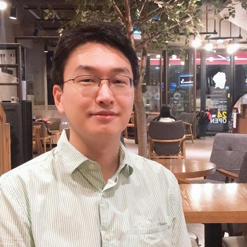

# Professor

## <U>Eisung Yoon</U>
<!-- {: .align-left} -->

* **2018 ~ Now** Assistant professor, Department of Nuclear Engineering, UNIST, Ulsan, Republic of Korea
* **2015 ~ 2018** Computational Scientist (staff), Scientific Computation Research Center(SCOREC), Rensselaer Polytechnic Institute, Troy, NY, USA
* **2014 ~ 2015** Senior Researcher, Korea Institute of Nuclear Safety, DaeJeon, Republic of Korea
* **2010 ~ 2014** Research Assistant (instead of compulsory military service), Korea Advanced Institute of Science and Technology, DaeJeon, Republic of Korea

* **Ph.D.**(Sep. 2013) **Princeton University**, NJ, USA
    - Advisor: Prof. Taik Soo Hahm & Prof. Choong Seock Chang
* **MA**(Feb. 2006) **Seoul National University**,  Seoul, Republic of Korea
    - Advisor: Prof. Sang Hee Hong (FUSMA)
* **BA**(Feb. 2004) **Seoul National University**,  Seoul, Republic of Korea

---

# Ph.D. Program

## <U>Dongkyu Kim</U> (Mar. 2021 ~ )
* (2021~) Verification of a nonlinear Fokker-Planck-RMJ collision module

## <U>Taeuk Moon</U> (Jul. 2021 ~ )
* (2021~) Investigation of heating modules in GENE

## <U>Sungpil Yum</U> (Mar. 2022 ~ )
* (2022~) Magnetic island simulation / Divertor simulation(IM-CDT)

----

# Ph.D. Program in Collaboration

## <U>Wonjun Tae</U> (Jun. 2018 ~ )
* in [CPL](http://cpl.unist.ac.kr/), Department of Physics, UNIST
* (2020~) Magnetic island simulation using GENE

## <U>Geon Kim</U> (Mar. 2019 ~ )
* in [URANUM](https://sites.google.com/view/uranum), Department of Nuclear Engineering, UNIST
* (2019~) Development of a code-package to estimate lifetime of neutron absorbers in spent fuel pool of nuclear power plant

----

# Interns

## <U>Haluk Aksoy</U> (Sep. 2021 ~ )
## <U>Hyungjun Noh</U> (Jan. 2022 ~ )
## <U>Chan-Ju Park</U> (Jan. 2022 ~ )
## <U>Dami Jung</U> (Mar. 2022 ~ )

----

# Alumni

## Postdoctor
### <U>Sangil Choi</U>
* **Feb. 2019 ~ Feb. 2020** Postdoctoral researcher

----

## NEUMA (NEUral plasMA, UIRP 2021, May. 2021 ~ Dec. 2021)
<U>Jonghoon Byun</U>  
<U>Ji-Seon Kim</U>  
<U>Yunhui Kim</U>  
<U>Hyun-Seop Lee</U>  
<U>Hyungjun Noh</U>  
<U>Chan-Ju Park</U>  

----

## Interns in past

<U>Dongkyu Kim</U> (Sep. 2019 ~ Feb. 2021)  
<U>Seungwan Kang</U> (Mar. 2021 ~ Dec. 2021)  
<U>Jisung Oh</U> (Jul. 2021 ~ Sep. 2021: Summer internship )  
<U>Sungpil Yum</U> (Oct. 2021 ~ Feb. 2022)  
