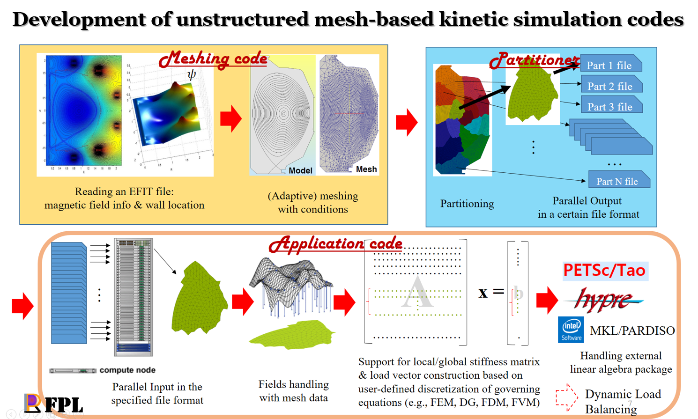
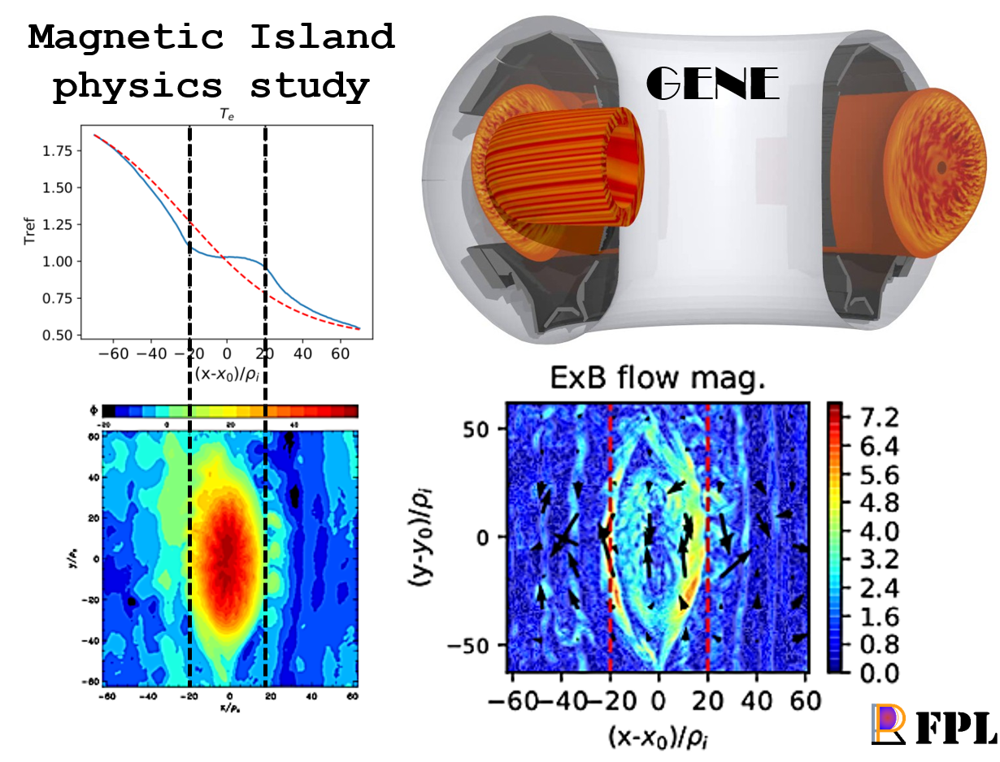
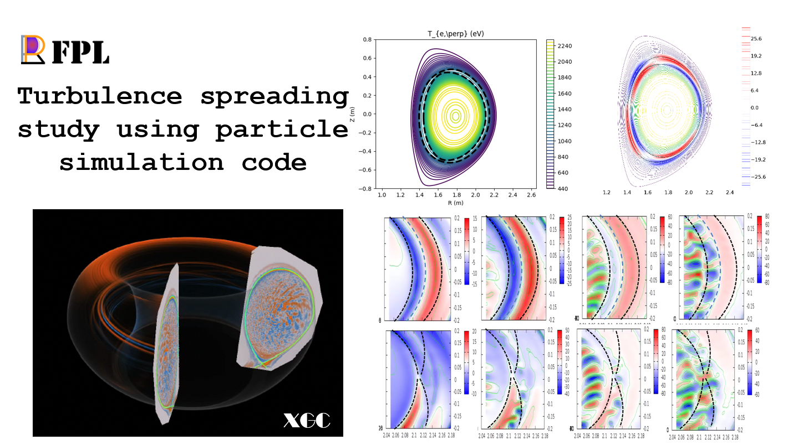
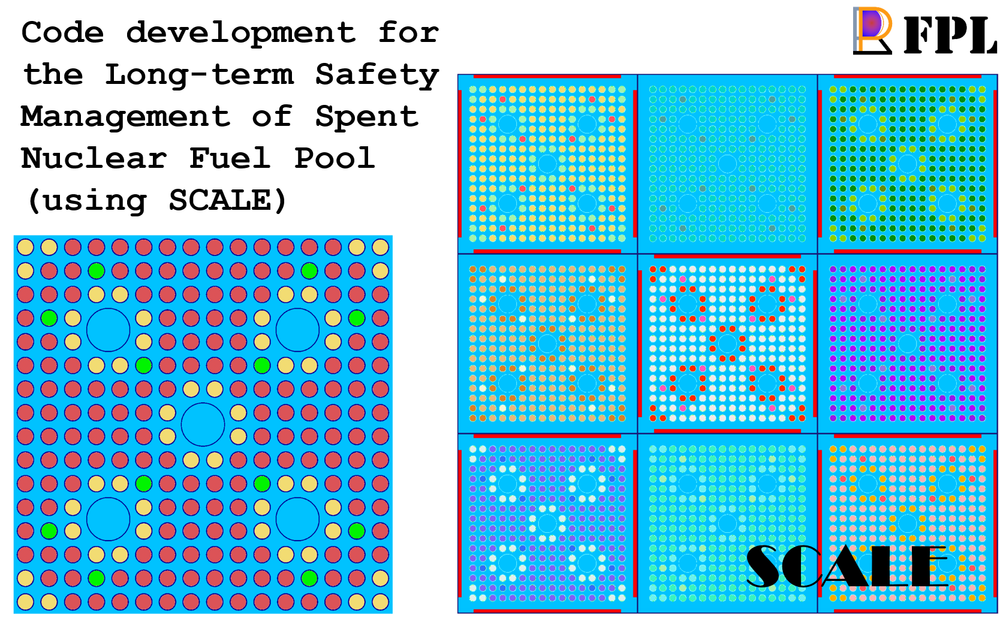

Thank you for your interest on our research activities. From the recent academic history, you'll see what we're currently doing.

## Research topics of our interests

* Physics and simulations of Gyrokinetics and turbulence transport in nuclear fusion
* Virtual Tokamak development (Digital twin, VR) - Unreal game engine, Unity, Blender, etc...
* Automatic unstructured mesh generation and its utilization - [PUMI](https://github.com/SCOREC/core)([RPI SCOREC](https://scorec.rpi.edu/)), SimModSuite([Simmetrix](http://www.simmetrix.com/))
* High performance computing (Code parallelization and optimization)
* Machine learning (Data-driven & Physics-Informed)

## Selected articles

### 2023
* Geon Kim, Yunsong Jung, Myeongkyu Lee, **Eisung Yoon\***, Sangjoon Ahn\*, SANTA: A safety analysis code for neutron absorbers in spent nuclear fuel pools, Computer Physics Communications **282**, 108513 [Link](http://dx.doi.org/10.1016/j.cpc.2022.108513)

### 2022
* **Dongkyu Kim**, Janghoon Seo, Gahyung Jo, Jae-Min Kwon, **Eisung Yoon\***, Nonlinear Fokker-Planck collision operator in Rosenbluth form for gyrokinetic simulations using discontinuous Galerkin method, Computer Physics Communications **279**, 108459 [Link](http://dx.doi.org/10.1016/j.cpc.2022.108459)
* D. Kim, J. Kang, M.W. Lee, J. Candy, **E.S. Yoon**, S. Yi, J.-M. Kwon, Y.-c, Ghim, W. Choe, C. Sung*, Progress in gyrokinetic validation studies using NBI heated L-mode discharge in KSTAR, Current Applied Physics **42**, 60 [Link](http://dx.doi.org/10.1016/j.cap.2022.07.015)
* Gahyung Jo*, Jae-Min Kwon, Janghoon Seo, **Eisung Yoon**, Development of a gyrokinetic hyperbolic solver based on discontinuous Galerkin method in tokamak geometry, Computer Physics Communications **273**, 108265 [Link](http://dx.doi.org/10.1016/j.cpc.2021.108265)

### 2021
* Gerrett Diamond*, Cameron W. Smith, Chonglin Zhang, **Eisung Yoon**, Mark S. Shephard, PUMIPic: A mesh-based approach to unstructured mesh Particle-In-Cell on GPUs, Journal of parallel and distributed computing **157**, 1 [Link](http://dx.doi.org/10.1016/j.jpdc.2021.06.004)

For more information, see [Google scholar](https://scholar.google.com/citations?user=RDQ5jv8AAAAJ&hl=ko), and [ScholarWorks@UNIST](https://scholarworks.unist.ac.kr/researcher-profile?ep=3655).

## Selected conference presentations

### 2023
* **Sungpil Yum**, **Kyu Been Kwon**, and **Eisung Yoon\***, `Numerical grid matching for Coupling SOLPS-ITER and NEO`, Transactions of the Korean Nuclear Society Spring Meeting, Jeju, Korea, May 18-19, 2023
* **Dami Jung**, Jae-Min Kwon, and **Eisung Yoon\***, `Selecting dominant modes and reducing data dimensionality on GENE data with DMD`, Transactions of the Korean Nuclear Society Spring Meeting, Jeju, Korea, May 18-19, 2023

### 2022
* **Taeuk Moon**, Tongryeol Lee, Juhyung Kim, Jae-Min Kwon, and **Eisung Yoon\***, `Ray-casting based detection of fast ion collision on plasma-facing wall implemented in NuBDeC`, KPS 70th Anniversary and 2022 Fall Meeting
* **Sungpil Yum** and **Eisung Yoon\***, `Unsupervised machine-learning algorithm for Orbit classification of electron trajectory under magnetic island`, KPS 70th Anniversary and 2022 Fall Meeting
* **Eisung Yoon** and Jae-Min Kwon*, Learning data-driven kinetic Landau fluid closures from particle simulations, INTERNATIONAL FUSION AND PLASMA CONFERENCE 2022
* **Taeuk Moon**, Gahyung Jo, Janghoon Seo, Juhyung Kim, Jae-Min Kwon, and **Eisung Yoon\***, `About Introducing Field-aligned Prism Elements in Tokamak Geometry`, INTERNATIONAL FUSION AND PLASMA CONFERENCE 2022
* **Chanju Park**, **Eisung Yoon\***, **Wonjun Tae**, Jayhyun Kim, Jisung Kang, Jae-Min Kwon, and Minjun J. Choi, `Simulation of flows near magnetic island observed in KSTAR experiments using GENE`, INTERNATIONAL FUSION AND PLASMA CONFERENCE 2022
* _(Oral)_ **Hyeongjun Noh**, Jimin Lee*, and **Eisung Yoon**, `Deep Learning-based Fokker-Planck-Landau Collision Operator for Fusion Plasma Simulation: A Preliminary Study`, The 54th KNS 2022 Spring Meeting
* **Sungpil Yum**, **Eisung Yoon\***, **Wonjun Tae**, **Dongkyu Kim**, and Min Sup Hur, `Particle motions in Magnetic Island`, The 54th KNS 2022 Spring Meeting

## Research projects (Ongoing)

* Three dimensional visualization of plasma and development of simulation data analysis technique for nuclear fusion digital twin ('23 ~ '25, NRF grant-PI: Prof. Sun-Jeong Kim @ Hallym Univ.)
    * ESY
* Data-driven modeling of governing equation for plasmas ('23 ~ '24, UNIST grant)
    * Darian Figuera, Dami Jung, ESY
* Development of a unified core-edge-SOL code for divertor design ('22 ~ '24, NRF grant)
    * Sungpil Yum, ESY
* Development of mesh technology to visualize simulation results in virtual reality ('22 ~ '23, KFE grant)
    * Taeuk Moon, Darian Figuera, ESY
    * Virtual K-STAR (Digital twin) dev
    * gKPSP3 (3D whole device modeling) dev
    * NuBDeC (Fast ion) dev
    * MHD code dev
* Development of educational program for human resources in nuclear fusion ('21 ~ '24, KHNP grant)
    * ESY
* Artificial Intelligence based Nuclear Fusion Plasma Collision Simulation ('22 ~ '23, UNIST grant-PI: Prof. Jimin Lee @ UNIST)
    * Hyungjun Noh, Prof. Jimin Lee (UNIST RAMI Lab), ESY

---

## Research projects (Past)

### Gyrokinetic Code Development: gKPSP2

* Research fund granted by National Fusion Research Institute ('19 ~ '21)

### Plasma Turbulence near Magnetic Island

* Interaction between Magnetic Island and Turbulence
    * Research fund granted by National Research Foundation of Korea ('19 ~ '21)
* Turbulence spreading over Magnetic Island ('19 ~ )

### Multi-Scale Simulation Code Development for the Long-term Safety Management of Spent Nuclear Fuel Pool

* Research fund granted by National Research Foundation of Korea ('19 ~ '21)

